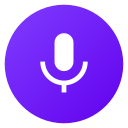

  

# 🎙️ Voice Recorder — Premium Audio Capture

Welcome to **Voice Recorder**! A simple, beautiful, and powerful voice recording app for Android. Designed to be clean and easy to use, Voice Recorder helps you capture your ideas, meetings, and memories with professional quality.

## 📥 Download

You can also find all versions on our [GitHub Releases](https://github.com/sudo-py-dev/VoiceRecorder/releases) page.

---

## ✨ Key Features

*   🎙️ **Professional Sound Quality** — Record everything from quick notes to long interviews with crystal-clear audio.
*   📊 **Real-time Visualizer** — See your voice in action with a live waveform that shows exactly what's being captured.
*   📂 **Easy Management** — Quickly search, rename, and organize your recordings. Choose where to save them on your device for easy access.
*   🌍 **Multi-Language Support** — Fully localized for English, Spanish, French, German, and Hebrew users.
*   🌓 **Customizable Design** — Enjoy a beautiful interface that adapts to your style with support for Light and Dark modes.
*   ⚡ **Background Recording** — Keep recording even while using other apps, with convenient controls in your notification bar.
*   🛡️ **Privacy & Security** — Your recordings stay on your device. Choose between a secure private folder or a public folder for easy sharing.

---

## 🎧 High-Quality Formats

Choose the recording format that fits your needs:
*   **WAV** — Uncompressed high-fidelity audio for professional use.
*   **M4A/AAC** — The standard for high quality at efficient file sizes.
*   **AMR** — Compact format ideal for simple voice notes.
*   **OGG** — Modern, high-performance audio compression.

---

## 🛠️ How to Use

Voice Recorder is built to be lightweight and fast. Simply open the app, grant the necessary permissions, and tap the record button to start. Your recordings are automatically saved and organized for you to review or share at any time.

---

## 🌍 Supported Languages
*   🇺🇸 English
*   🇪🇸 Español
*   🇫🇷 Français
*   🇩🇪 Deutsch
*   🇮🇱 עברית

---

## ❤️ Credits

Voice Recorder is developed with a focus on simplicity, quality, and user privacy. 

Developed with ❤️ by **ed apps**.
